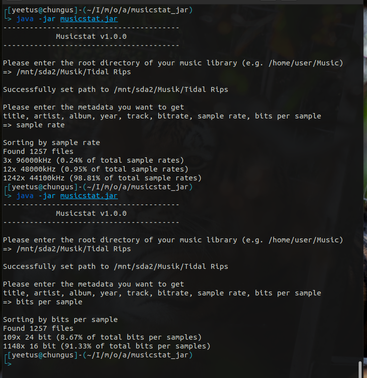

# musicstats
Statistics about your local music library, based on JAudioTagger


## About
This program can:

- Scan a root library directory for all audio/music files, including scanning subdirectories.
- Implemented support for flac, alac, mp3, wav and ogg files, though you can add any other format that is supported by JAudioTagger.
- Fetch all of the important metadata. Title, artist, album, date, track, bitrate, sample rate, bit depth/bits per sample.
- Display and sort the frequency of your artists, albums, etc. You can let this program display any of the above mentioned metadata this way.

## Usage
Execute ```java -jar musicstat.jar``` in a terminal and follow the instructions.

I have only tested this program in Linux and macOS environments running the latest version of Java 15.
No support for older versions of Java and I don't want to boot into Windows to try this out.
